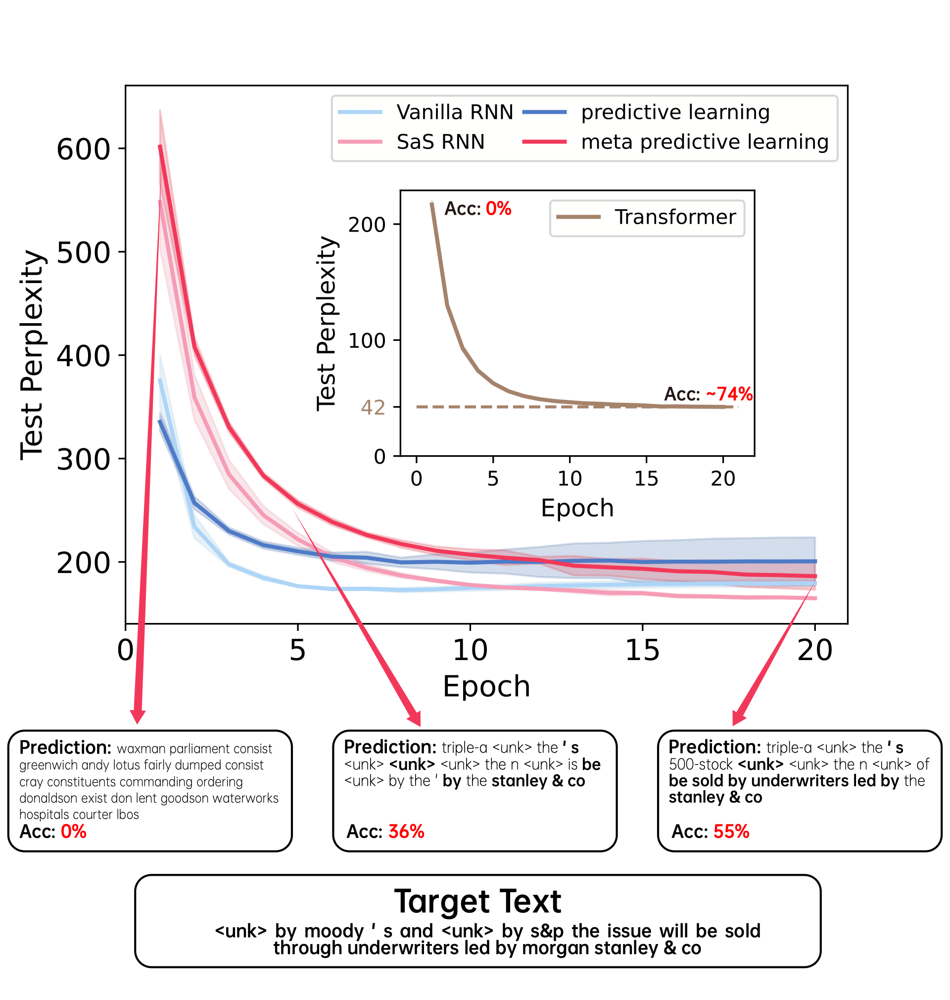

# MPC training on real corpus (PTB corpus)

## Code structure

- Tasks.py, all tasks (train networks, plot figures) are included in this file.
- TrainConfig.yaml, setting training hyper parameters
- Train.py Models.py Corpus.py Vocabulary.py, main programs for loading data, creating vocabulary and training networks
- Data, storing the datasets, training records and model parameters
- Figures, some figures

## Requirements

- Python 3.10
- Pytorch 1.13 with Cuda 11.6
- torchtext 0.14
- torchdata 0.5

## Results

